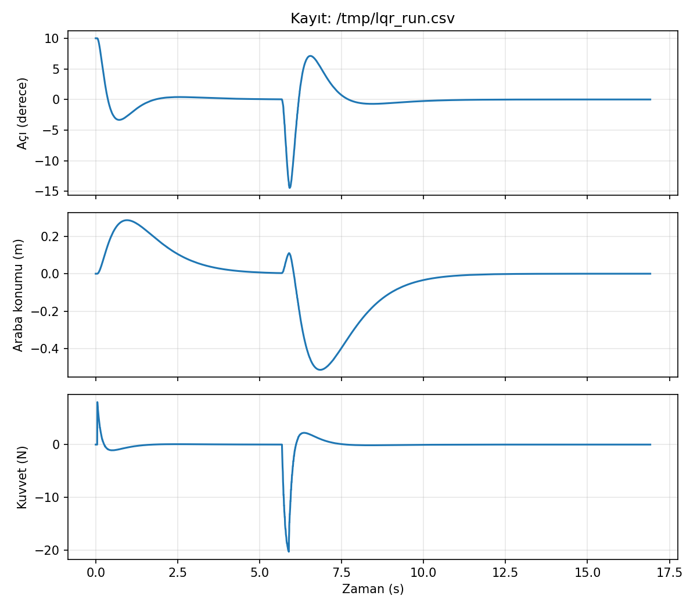
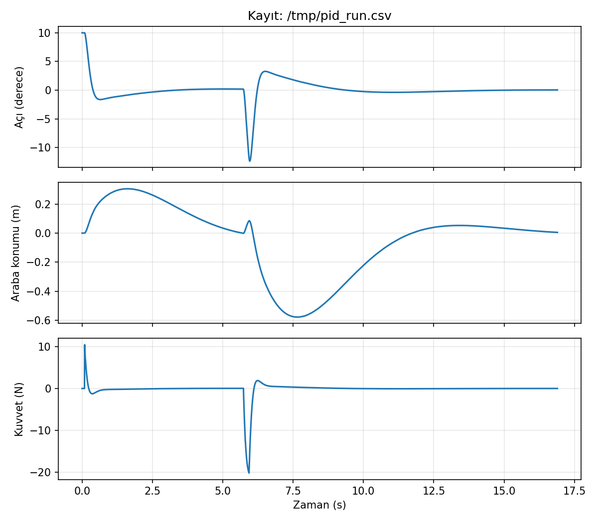

# ROS 2 Cart-Pole Control

Ters sarkaç (cart-pole) simülasyonu ve **LQR / PID** denge kontrolü, **ROS 2 (Jazzy)** düğümleri olarak.
Önceki [cartpole-balance-control](../cartpole-balance-control) projesindeki fizik ve denetleyiciler
burada üç ayrı düğüme bölündü: simülatör, denetleyici ve kayıt düğümü birbirleriyle topic ve servislerle konuşuyor.

## Mimari

```
                 /cartpole/state  (Float64MultiArray: x, x_dot, theta, theta_dot)
   ┌──────────┐ ───────────────────────────────►┌──────────────────┐
   │ sim_node │                                  │ controller_node  │
   └──────────┘ ◄───────────────────────────────└──────────────────┘
        ▲        /cartpole/force  (Float64: N)         (LQR veya PID)
        │ servisler: /cartpole/push, /cartpole/reset
        │
   ┌─────────────┐   state ve force topic'lerini dinler, CSV'ye yazar
   │ logger_node │
   └─────────────┘
```

| Düğüm | Görevi |
|---|---|
| `sim_node` | Doğrusal olmayan fiziği RK4 ile 200 Hz entegre eder, durumu yayınlar. `/cartpole/push` ile dış itme, `/cartpole/reset` ile sıfırlama servisleri sunar |
| `controller_node` | Durumu dinler, `controller_type` parametresine göre LQR veya PID kuvveti hesaplar, ±30 N ile sınırlar |
| `logger_node` | Durum ve kuvveti CSV'ye kaydeder |

Fizik ve denetleyici kodu (`dynamics.py`, `controllers.py`) ROS'a bağımlı değil, bu yüzden `pytest` ile ROS olmadan test ediliyor.

## Çalıştırma (GitHub Codespaces)

Repoda `.devcontainer/` var, Codespace açılırken ROS 2 Jazzy ortamı otomatik kurulur (ilk açılış birkaç dakika sürer).

```bash
colcon build --symlink-install
source install/setup.bash
ros2 launch cartpole_ros cartpole.launch.py
```

PID ile başlatmak için: `ros2 launch cartpole_ros cartpole.launch.py controller:=pid`

Başka bir terminalde sistemi incele ve müdahale et:

```bash
ros2 node list
ros2 topic list
ros2 topic echo /cartpole/state
ros2 topic hz /cartpole/state
ros2 service call /cartpole/push std_srvs/srv/Trigger   # 15 N, 0.2 s dış itme
ros2 service call /cartpole/reset std_srvs/srv/Trigger  # başarısızlıktan sonra sıfırla
ros2 param get /cartpole_controller controller_type
```

Kaydı grafiğe çevirmek için (launch'u Ctrl+C ile durdurduktan sonra):

```bash
python3 tools/plot_log.py /tmp/cartpole_log.csv results/lqr_run.png
```

## Testler

```bash
cd src/cartpole_ros && python3 -m pytest -q
```

8 test: denge noktası, doğrusallaştırmanın doğruluğu, açık çevrimin kararsızlığı, LQR'ın kapalı çevrim kararlılığı, 10° eğimden toparlanma ve sadece açı geri beslemeli PID'in araba kaymasıyla raydan çıkması.

## Sonuçlar

Aynı senaryo iki denetleyiciyle çalıştırıldı: 10° eğimle başlangıç, yaklaşık 5,7. saniyede arabaya 0,2 s'lik 15 N dış itme (`/cartpole/push` servisi). Değerler grafiklerden okundu, yaklaşıktır.




| | LQR | PID + konum PD |
|---|---|---|
| 10°'den ilk toparlanma | ~2,5 s, -3,3° alt aşım | ~3 s, -1,6° alt aşım |
| İtme sonrası en büyük açı sapması | -14,5° | -12,3° |
| İtme sonrası ters yöne aşım | +7° | +3,3° |
| İtme sonrası araba sapması | -0,51 m | -0,58 m |
| Araba konumunun sıfıra dönmesi (itmeden sonra) | ~6 s, aşımsız | ~11 s, küçük aşımlı |
| Tepe kuvvet | ~-20 N | ~-20 N |

İki denetleyici de itmeyi bastırıp sistemi sıfıra getirdi, fakat farklı ödünleşim yaptı: PID açıyı daha sıkı tutuyor (daha küçük sapma ve aşım), LQR ise dört durumu tek kazanç vektörüyle birlikte yönettiği için araba konumunu daha hızlı ve aşımsız oturtuyor. PID'in yavaş konum toparlaması, konum kazançlarının açı kazançlarına göre zayıf olmasından kaynaklanıyor olabilir; kazançlar değiştirilerek denenmedi. Eğrilerin şekli ve tepe değerleri, aynı fiziğin bağımsız NumPy simülasyonuyla (cartpole-balance-control) örtüşüyor.

**Sınırlılıklar:** tek koşu, PID kazançları elle ayarlı, LQR ağırlıkları varsayılan değerlerde, sonuçlar "hangisi daha iyi" değil "hangi ödünleşim" olarak okunmalı.

## Tasarım notu: başlatma yarışı
Düğümler ayrı süreçler olarak başlıyor. Denetleyici `scipy` yükleyip LQR kazancını hesaplarken ve DDS düğümleri birbirine bağlarken simülatör çalışmaya devam ederse, 10° eğimli çubuk yaklaşık 0,65 s'de devrilir (açık çevrim kararsız). İlk çalıştırmada tam olarak bu oldu. Çözüm: `sim_node` ilk `/cartpole/force` mesajı gelene kadar bekliyor (`wait_for_controller: true`). Gerçek donanımda karşılığı, denetleyici hazır olmadan eyleyicinin etkinleştirilmemesidir.

## Sınırlılıklar
- Tam durum ölçümü varsayıldı (sensör gürültüsü ve durum kestirimi yok)
- Simülatör tek makinede gerçek zamansız (wall-clock) timer ile çalışıyor; `use_sim_time` ve `ros2 bag` entegrasyonu yok
- Kontrol döngüsü simülatörün yayın hızına bağlı (bir adım gecikme)
- Sonraki adımlar: Kalman filtresi düğümü, `ros2 bag` ile kayıt/oynatma, özel mesaj tipleri, Gazebo
